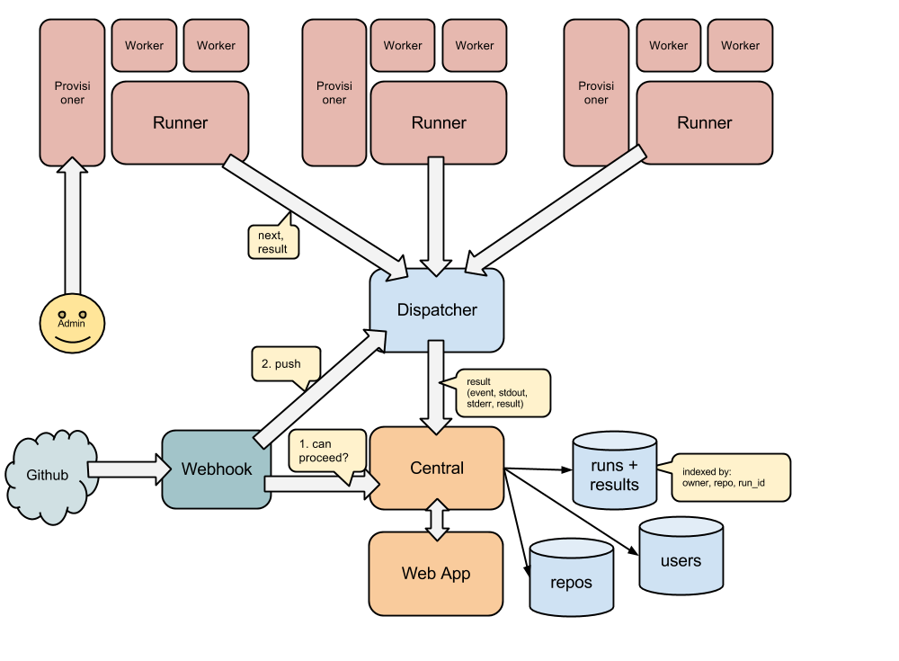

* [Architecture](#architecture)
* [Instructions](#instructions)
* [Modules](#modules)

## Architecture

## Modules

* [runner-smartos](https://github.com/ntrace/runner-smartos): Runs the benchamarks and dtrace on SmartOS VMs
* [dispatcher](https://github.com/ntrace/dispatcher): Receives events from runners and provides jobs for runners
* [provisioner](https://github.com/ntrace/provisioner): VM provisioning
* [central](https://github.com/ntrace/central): Persistence, authorization and permission service for all the data coming from dispatcher
* [webapp](https://github.com/ntrace/webapp): Web front-end for end-users

## Instructions

1. [Install Runner](instructions/01.install_runner.md)

